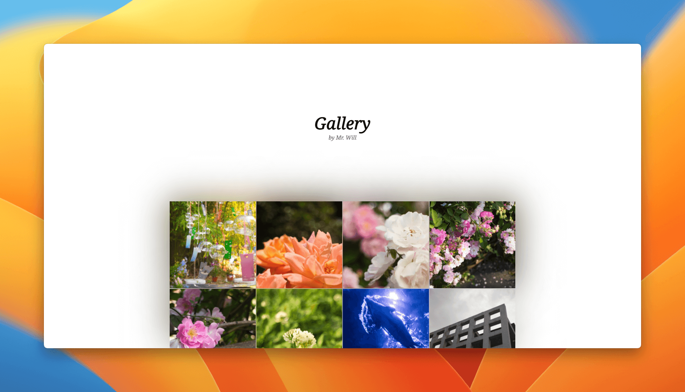
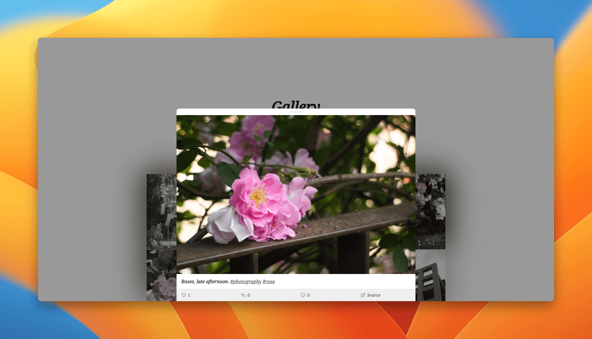

# Next Mastodon Gallery

A [Next.js](https://nextjs.org/)-powered gallery for [Mastodon](https://joinmastodon.org/).

<p align="center"><a href="https://gallery.mrwillcom.com/"><strong>Preview</strong></a> / <a href="https://vercel.com/new/clone?repository-url=https%3A%2F%2Fgithub.com%2FMrWillCom%2Fnext-mastodon-gallery">One-Click Deploy</a></p>



<details>
  <summary>Preview screenshot of details drawer</summary>
  
</details>

## Getting Started

[](https://vercel.com/new/clone?repository-url=https%3A%2F%2Fgithub.com%2FMrWillCom%2Fnext-mastodon-gallery)

After deployment, you may need to make changes to [configuration](#configuration).

## Configuration

A ready configuration is in `config.tsx`, options are all commented and typed.

### About Mastodon API query URL

First, you need to get your account ID, according to [Lookup account ID from Webfinger address - Mastodon documentation](https://docs.joinmastodon.org/methods/accounts/#lookup), you can make a request to your instance:

```sh
> curl 'https://<your-instance>/api/v1/accounts/lookup?acct=<your-username>'
{"id":"72358"...}%
       ^^^^^
       account ID
```

Then, you can refer to [Get account’s statuses - Mastodon documentation](https://docs.joinmastodon.org/methods/accounts/#statuses), here is an example:

```sh
> # get all statuses tagged with `#photography`, excepted the ones without media attachments.
> curl 'http://<your-instance>/api/v1/accounts/<your-account-id>/statuses?only_media=true&tagged=photography'
```

Once you get a satisfied URL, put it into `query` in `config.tsx`.

## Development

First, run the development server:

```sh
pnpm dev
```

Then, open [http://localhost:3000](http://localhost:3000).
